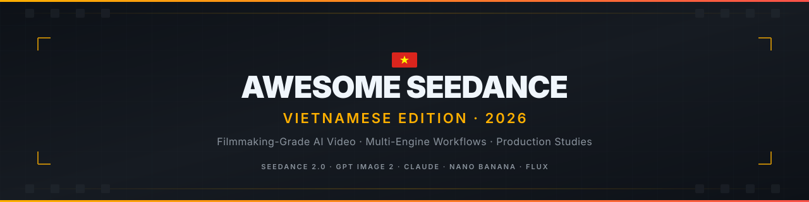
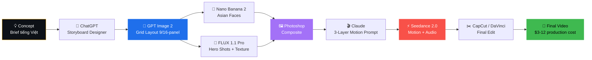

# 🎬 Awesome Seedance 2.0 + GPT Image 2

### Vietnamese Edition · Filmmaking-Grade AI Video Workflows

**The most comprehensive open-source resource for production-grade AI video creation in Vietnam.**
**Curated workflows · Real case studies · Vietnamese cultural specificity · Anti-AI-slop.**

 

  
  
  
  

  
  
  
  

 

[**🇻🇳 Tiếng Việt**](README.md) · [**🇬🇧 English**](README.en.md) · [**📚 Docs**](resources/) · [**🎬 Case Studies**](case-studies/) · [**💬 Zalo Community**](https://zalo.me/g/caqqva644) · [**𝕏 Updates**](https://x.com/0ailab)

---

### 📊 By the Numbers

| 53 | 5 | 4 | 95% | 80% |
|:--:|:-:|:-:|:---:|:---:|
| **Files** | **Case Studies** | **Master Workflows** | **Avg. Margin** | **Cost Savings** |
| Curated guides + prompts | Real production breakdowns | 16-panel expert templates | On premium client work | Vs. random iteration |

---

## 🎯 Tại Sao Repo Này Khác Biệt

> **AI video community ở VN đang ngập trong "AI slop"** — video 1-prompt nhạt nhẽo, generic Asian aesthetic, không có chiều sâu filmmaking.
>
> Repo này tập trung vào **kiến thức đỉnh cao**: filmmaking-grade workflows, multi-engine compositing, research-driven content, period-accurate cultural specificity. Mỗi tài liệu được kiểm chứng qua production thật với client trả tiền.

**🇬🇧** While AI video resources are abundant, most produce "AI slop" — single-prompt videos with generic aesthetics and no filmmaking depth. This repo focuses on **expert-tier knowledge**: filmmaking-grade workflows, multi-engine compositing, research-driven content, and Vietnamese cultural specificity. Every guide is battle-tested in real paid client production.

---

## 🚀 Quick Start

**🇻🇳 Mới với Seedance?** Đọc theo thứ tự:

1. 📘 [What is Seedance 2.0?](resources/01-what-is-seedance.md) — Tổng quan model
2. 📗 [The 6-Step Prompt Formula](resources/02-six-step-formula.md) — Công thức cơ bản
3. 📙 [3-Layer Motion Prompt Structure](resources/03-three-layer-prompt.md) — **Chuẩn mới 2026**
4. 📕 [Storyboard Grid Method](resources/04-grid-method.md) — Pipeline tiết kiệm 70% credit
5. 🎨 [Ready-to-Use Prompts](prompts/README.md) — Copy-paste để bắt đầu

**Đã quen rồi? Đi thẳng vào expert tier:**

- ⭐ [**16-Panel Master Grid Series**](workflows/02-grid-16-panel/) — 4 expert templates
- 🎬 [**Real Case Studies**](case-studies/) — Production breakdowns với ROI
- 🛠️ [**System Prompts**](workflows/04-system-prompts/) — Claude / ChatGPT / Gemini / Grok ready-to-paste

---

## 🔄 The Production Pipeline

> **Multi-engine composite workflow** — kỹ thuật được documented chỉ ở repo này. Mỗi engine làm phần mạnh nhất của nó. Quality 5x higher than single-model approach, cost 60-70% lower than naive iteration.

📚 **Deep dive:** [Pipeline 4 bước CHUẨN 2026](workflows/) · [Multi-engine composite technique](workflows/02-grid-16-panel/) · [4-step iteration loop](workflows/05-iteration-loop.md)

---

## ⭐ 16-Panel Master Series — The Flagship

**Đây là điểm khác biệt lớn nhất của repo.** Trong khi 99% video AI cổ trang trên TikTok hiện tại là "AI slop" generic Asian, **16-Panel Master Series** đưa workflow lên filmmaking grade.

<table>
<tr>
<td width="50%">

#### 🎵 [Dance MV](workflows/02-grid-16-panel/01-dance-mv.md)
**K-pop / V-pop Choreography**

Multi-angle coverage industry standard. BPM-sync editing. Hero pose for thumbnail. Outfit consistency locked.

**Pricing tier:** 5–30tr VND

</td>
<td width="50%">

#### 👘 [Cổ Trang](workflows/02-grid-16-panel/02-co-trang.md)
**Period Drama Vietnam**

Research-driven Trần / Lê sơ / Nguyễn dynasty accuracy. Era-correct áo giao lĩnh, kiếm Đông A, hành cung architecture.

**Pricing tier:** 8–50tr VND

</td>
</tr>
<tr>
<td width="50%">

#### 💎 [TVC Luxury](workflows/02-grid-16-panel/03-tvc-luxury.md)
**Premium Commercial Cinematography**

Hero shot beauty pass on materials (crystal, gold, silk). Multi-engine composite. Wong Kar-wai meets Hermès aesthetic.

**Pricing tier:** 15–80tr VND

</td>
<td width="50%">

#### 🎬 [Short Film](workflows/02-grid-16-panel/04-short-film.md)
**Festival Narrative**

Save the Cat beat structure. 90-second sustained narrative. Festival submission grade quality.

**Pricing tier:** 10–200tr VND

</td>
</tr>
</table>

**Mỗi master template chứa:** Research lịch sử/brand · Character Bible đầy đủ · 16-beat outline với filmmaking grammar · Full grid + motion prompt ready-to-paste · Multi-engine composite technique · Cost analysis · Director references.

[**👉 Đọc 16-Panel Master Series**](workflows/02-grid-16-panel/)

---

## 🎬 Real Case Studies

> Mỗi case study có: **Brief tiếng Việt** → **Storyboard prompt** → **Motion prompt** → **Final result** → **ROI breakdown thật**.

<table>
<tr>
<td align="center" width="20%">

**01**
[**Henshin**](case-studies/01-henshin-transformation/)
Saigon → Samurai
  
🎯 8s · 9:16
 
💰 2-5tr VND
 
📈 95% margin

</td>
<td align="center" width="20%">

**02**
[**Drama**](case-studies/02-drama-tieu-thu-gia/)
Tiểu Thư Giả
  
🎯 12s · 9:16
 
💰 5-15tr VND
 
📈 97% margin

</td>
<td align="center" width="20%">

**03**
[**TVC**](case-studies/03-tvc-nuoc-hoa-saigon/)
Nước Hoa Saigon
  
🎯 30s · 16:9
 
💰 8-30tr VND
 
📈 96% margin

</td>
<td align="center" width="20%">

**04**
[**ASMR**](case-studies/04-asmr-macro-skincare/)
Macro Skincare
  
🎯 12s · 9:16
 
💰 1.5-5tr VND
 
📈 91% margin

</td>
<td align="center" width="20%">

**05**
[**What-If**](case-studies/05-what-if-saigon-jungle/)
Saigon Jungle
  
🎯 15s · 16:9
 
💰 8-30tr VND
 
📈 90% margin

</td>
</tr>
</table>

---

## 📺 5 Trending Formats Q2/2026

> Top 5 viral formats trên TikTok #seedance — view trung bình 100K-2M+ mỗi clip

| Format | Description | Example |
|:------:|-------------|:-------:|
| 🌟 **HENSHIN** | Biến hình từ ảnh người thật → warrior/anime version. Khuôn mặt giữ nguyên. | [→ Tutorial](case-studies/01-henshin-transformation/) |
| 🌀 **SATISFYING LOOP** | Vật morphing A→B→A. Magic keyword: `seamless loop-ready motion`. | [→ Mercury Sphere](prompts/01-affiliate/22-mercury-loop.md) |
| 👁️ **POV / ORB** | Single continuous 15s shot, camera = mắt nhân vật. | [→ Knight battle](prompts/02-drama/23-pov-knight.md) |
| 🧴 **ASMR MACRO** | Extreme close-up + tactile sound design. | [→ Skincare gel](case-studies/04-asmr-macro-skincare/) |
| 🌳 **WHAT-IF SURREAL** | Landmark quen + magical realism twist. | [→ Saigon jungle](case-studies/05-what-if-saigon-jungle/) |

---

## 🎨 Prompts Library

| Category | Aspect | Best For | Status |
|----------|:------:|----------|:------:|
| 🛍️ [Affiliate / Bán hàng](prompts/01-affiliate/) | 9:16 | TikTok, Reels | 2 prompts ⭐ |
| 🎭 [Drama ngắn](prompts/02-drama/) | 16:9 | Short film, MV cinematic | 2 prompts ⭐ |
| 📺 [TVC sản phẩm](prompts/03-tvc/) | Dual | Brand ads | Templates ✓ |
| 🎵 [Music Video](prompts/04-mv/) | 16:9 | K-pop, V-pop, ballad | Templates ✓ |
| 🌏 [Documentary / B-roll](prompts/05-documentary/) | 16:9 | Travel, what-if, nature | 1 prompt ⭐ |

---

## 🔧 Workflows

| # | Workflow | Use Case |
|:-:|----------|----------|
| 1 | [9-Panel Grid](workflows/01-grid-9-panel.md) | **Default — 80% projects.** 8-12s video. |
| 2 | ⭐ [16-Panel Master Series](workflows/02-grid-16-panel/) | **Expert tier.** 4 specialized templates. |
| 3 | [Character Bible System](workflows/03-character-bible.md) | Multi-shot identity locking. |
| 4 | [System Prompts](workflows/04-system-prompts/) | Claude / ChatGPT / Gemini / Grok ready-to-paste. |
| 5 | [4-Step Iteration Loop](workflows/05-iteration-loop.md) | Save 75% credits vs random iteration. |

---

## 🛠️ Tools & Platforms

### Video Generation
| Platform | Region | Notes |
|----------|:------:|-------|
| [Jimeng / Dreamina](https://jimeng.jianying.com) | 🇨🇳 + VPN | Newest features, generous free quota |
| [0ai.vn](https://0ai.vn) | 🇻🇳 direct | Production stable, không cần VPN, support 4K |

### Image Models (multi-engine composite)
| Model | Best For |
|-------|----------|
| **GPT Image 2** | Multi-cell grids, panel layouts |
| **Nano Banana 2** | Asian characters, áo dài, K-face skin tone |
| **FLUX 1.1 Pro** | Photorealistic skin, fabric, hands |
| **Recraft V3** | Typography, brand assets |

📚 [Full platforms comparison](resources/06-platforms-comparison.md)

---

## 💰 Vietnam Market Pricing (May 2026)

| Format | Standard | Premium 16-Panel |
|--------|:--------:|:----------------:|
| Affiliate video 8s | 0.5 – 2tr | — |
| TVC 30s | 3 – 30tr | 15 – 80tr |
| Drama short 60s | 3 – 15tr | — |
| K-pop MV 15s | 5 – 30tr | 8 – 30tr |
| Cổ trang drama 15s | — | 8 – 50tr |
| Festival short film 90s | — | 50 – 200tr |

📚 [Full pricing guide + how to charge clients](resources/07-pricing-vn-market.md)

---

## 📚 Deep Dive Resources

<table>
<tr>
<td width="50%">

#### 🧠 Foundations
- [What is Seedance 2.0?](resources/01-what-is-seedance.md)
- [The 6-Step Prompt Formula](resources/02-six-step-formula.md)
- [3-Layer Motion Prompt](resources/03-three-layer-prompt.md)
- [Storyboard Grid Method](resources/04-grid-method.md)

</td>
<td width="50%">

#### 🚀 Production
- [Scene Archetype Router](resources/05-archetype-router.md)
- [Platforms Comparison](resources/06-platforms-comparison.md)
- [Vietnam Market Pricing](resources/07-pricing-vn-market.md)
- [Ethics & Vietnam Law 2026](resources/08-ethics-and-law.md)

</td>
</tr>
</table>

---

## 🤝 Community

### Đóng góp / Contribute

PR welcome! Đóng góp được chấp nhận:
- ✅ Prompt mới đã test thành công (kèm video proof)
- ✅ Case study từ dự án thật của bạn
- ✅ Dịch tài liệu (VN ↔ EN)
- ✅ Bug report / typo fix · Workflow improvements

[**📋 Submission template**](.github/prompt-template.md) · [**📖 Contributing guide**](CONTRIBUTING.md)

### Top Contributors

---

## 📈 Star History

<a href="https://www.star-history.com/#NhatETH/awesome-seedance-vn&Date">
 <picture>
   <source media="(prefers-color-scheme: dark)" srcset="https://api.star-history.com/svg?repos=NhatETH/awesome-seedance-vn&type=Date&theme=dark" />
   <source media="(prefers-color-scheme: light)" srcset="https://api.star-history.com/svg?repos=NhatETH/awesome-seedance-vn&type=Date" />
   
 </picture>
</a>

---

## 📜 License & Disclaimers

This work is licensed under [**MIT License**](LICENSE) — free for commercial and non-commercial use.

**Inspired by** open-source AI video community resources. All prompts and techniques are shared for educational purposes.

> ⚠️ **Unofficial community resource.** Seedance 2.0 is a product of ByteDance. GPT Image 2 is a product of OpenAI. Claude is a product of Anthropic. Not affiliated with any of these companies.
>
> Be mindful of [**Vietnam's AI deepfake regulations 2026**](resources/08-ethics-and-law.md) — penalties range from 50-200 million VND for misuse.

---

### ⭐ Star this repo if you find it useful

**Made with ❤️ in Saigon by [@0ailab](https://x.com/0ailab)**

*Filmmaking-grade AI video, one frame at a time.*

[⬆ Back to top](#-awesome-seedance-20--gpt-image-2)

